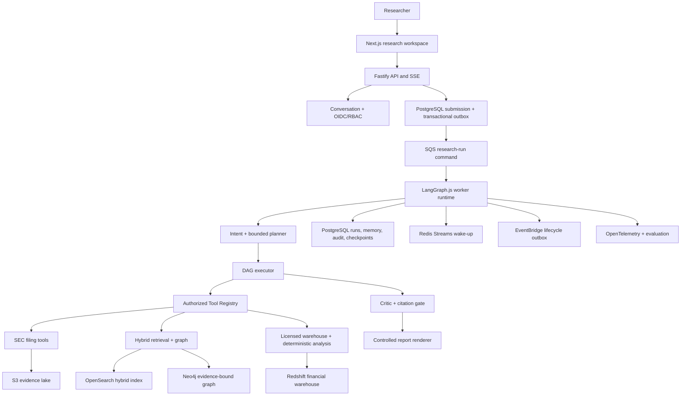

# Interactive Research Agent 架构基线

## 目标与边界

本系统是面向美股投研与教育用途的、证据驱动的研究平台，而非通用聊天机器人。
它将用户问题转为可回放的受限研究任务，只通过已批准、可审计的工具访问官方披露与经许可数据。系统不执行交易、不生成个性化买卖指令；没有可访问的有效证据时必须部分回答或拒答。

生产运行时全部采用 TypeScript。Python 原型仅位于 `legacy/python-prototype`，不得进入生产请求路径或容器镜像。

## 系统拓扑

## 模块所有权

| 模块 | 责任 | 关键约束 |
| --- | --- | --- |
| `apps/api`, `packages/conversation` | OIDC、会话、消息、SSE、公共 DTO | API 投影不泄露 tenant/创建者/摄入元数据 |
| `packages/agent-runtime`, `packages/models` | Intent、计划、执行、Critic、LangGraph state machine | 最多 12 个任务、5 分钟、一次补证；每个原子任务恰好一次工具调用，模型不能增加工具 |
| `packages/tools` | manifest、授权、超时、重试、熔断、幂等与审计 | Agent 只能调用提交时快照中的可见工具 |
| `packages/knowledge` | 证据湖、混合检索、图谱、仓库契约、RAG 安全门 | tenant/entitlement 过滤在索引与本地均复核 |
| `packages/memory` | 短期、确认的长期、研究记忆及删除传播 | 研究记忆与图谱只可作检索线索，不能支持 Claim |
| `packages/db`, `packages/runs`, `packages/reports` | PostgreSQL 仓储、迁移、原子发布、审计 | 所有用户/运行派生记录具直接 tenant key；报告、研究记忆、助手消息、终态和终态事件同一事务提交 |
| `packages/observability`, `packages/evaluation` | trace、成本、黄金评测、质量门 | trace 键贯穿 conversation → run → task → tool |

## 研究工作台交互契约

- 浏览器以 SSE 渲染运行事件，并使用 `Last-Event-ID` 从持久化事件流恢复。`claim_delta` 仅是待审查内容；只有 Critic 与引用校验通过后持久化的报告才显示正式引用编号与证据入口。
- 浏览器 SSE 帧解析兼容 CRLF、任意网络分块、注释心跳与多行 `data`；解析出的对象仍必须通过闭合 `RunEvent` schema，才可进入界面和续传序列。
- 会话支持新建、游标分页列表、重命名、归档、恢复和删除。归档可逆；删除是用户可见范围内的软删除（tombstone），不级联删除 `ResearchRun`、证据、报告、引用或审计记录。会话目录使用带快照时间的 `(updated_at, id)` stable keyset cursor，避免长期使用后固定首屏上限导致历史研究不可访问，并隔离分页过程中新增会话对既有页面的影响。
- 归档会话是只读研究档案：仍可查看对话、运行和引用，但必须先恢复，才能创建新的 turn 或追加消息。API、提交事务和会话仓储均重复执行该限制，避免 UI 状态或并发竞态绕过生命周期边界。
- 已经启动的 run 不因用户随后归档或软删除会话而被中断；其受控终态回答会通过独立的内部发布路径写入审计记录。该路径不接受用户输入，不能用来绕过归档限制。
- 历史问题的“修改并重新研究”会预填问题并创建一个新的、不可变的 research turn。它不会重写既有运行、工具调用、Claim 或引用，因此可审计性不因产品编辑功能而丢失。
- “暂停展示”只暂停浏览器对 SSE 事件的呈现并按 sequence 缓冲；研究 Worker 仍按既定预算受控执行。真正的运行暂停需要在安全检查点协调队列租约、工具取消与恢复语义，不能由前端按钮伪造。
- 后台运行控制的首发安全边界是 `queued`：`POST /v1/runs/{id}/pause` 只会在 Worker 领取前将 run 标为 `paused` 并记录 `run_paused`；`resume` 在同一持久化事务中写入 `run_resumed` 和原始不可变 command 的 outbox 记录。已进入 `running` 的 run 不会被强制终止，API 返回冲突，浏览器仍可使用“暂停展示”。
- 最终报告的引用由受权限保护的 Evidence API 解析，浏览器不得将流式草稿的证据数量或来源猜测为正式引用。
- 报告展示仅解析受限 Markdown 子集（标题、段落、列表、表格、引用块和代码块），且始终由 React 文本节点输出；不接受原始 HTML。正式引用编号被渲染为受控按钮，仍通过 Evidence API 读取授权证据。
- 证据与报告引用的外部来源链接仅允许 `http`/`https`，在 Zod 契约和浏览器组件两层校验；非 Web 协议不能进入可点击链接。

## 身份、角色与数据许可边界

- 企业 OIDC 是角色与数据许可的首发权威来源；API 仅接受已验证 JWT 中受限的 `researcher` / `admin` 角色及 entitlement claim，不接受客户端自行提交的权限字段。
- `PostgresPrincipalProvisioner` 将已验证 subject 映射为稳定的组织内用户 UUID，以满足关系型外键；它不把未经 IdP 管理的角色或许可提升为数据库事实。
- 每个 run command 会保留提交时经授权的工具 manifest 与 scope 快照，以便审计和重放判断；工具、检索、证据读取仍以该受控 scope 进行 tenant/许可校验。数据许可的撤销、JWT 生命周期和 IdP claim 映射须在部署验收中由企业身份团队验证。

## 一次研究运行

1. API 验证 OIDC、角色、数据许可和请求 schema，并把会话消息、Run、授权工具快照与 outbox 命令写入同一事务。
2. Worker 从 SQS 领取命令后重新从 PostgreSQL 解析不可变 command，拒绝信任可变的队列 payload。
3. LangGraph 执行 `load_context → analyze_intent → plan_research → execute_tasks → build_evidence → compose_claims → critic → publish_report`。`build_evidence` 在模型生成前去重、规范化和持久化可引用上下文；`compose_claims` 只能生成绑定 evidence ID 的结论。每个 `ResearchTask` 只能选择一个工具；多工具研究必须显式拆成有依赖关系的 DAG 任务。检查点记录已完成阶段，但工具执行后禁止自动重放，防止重复计费或重复访问许可数据。
4. 每项工具结果经 Zod、tenant、entitlement、成本与证据资格验证。SEC 证据被拆为可定位的原文片段；金融仓库记录必须带 `source_as_of`、期间、币种和单位。
5. Critic 校验任务覆盖、引用、数值、结构化金融数据冲突和独立蕴含 verdict。未通过时最多添加一次受原工具 allowlist 限制的补证任务。
6. 只有含有效引用的 Claim 才能进入受控报告模板。最终发布采用单事务，并在提交后才通过 Redis/SSE 宣告终态。

## 证据与引用不变量

- `research_memory` 与 `graph` 记录只用于搜索扩展，绝不进入模型 Claim 上下文、报告引用或 `research_run_evidence`。
- 所有 Claim 的 evidence ID 必须存在、属于当前组织、满足许可、匹配用户指定期间，并通过数值与语义蕴含校验。
- 同一实体、期间、`source_as_of`、指标、币种和单位出现不同规范化金融数值时，引用相关记录的 Claim 必须拒绝；不同 `source_as_of` 被视为可审计修订而非自动冲突。
- SEC 引用包含 accession、主文档、标准化字符区间、摘录序号和文档 hash，以便重现确切文本范围。

## 发布与演进规则

- 跨模块对象、模型输出、工具输入输出、队列消息和 HTTP 请求都必须由 `packages/contracts` 的 Zod schema 校验；禁止自由 JSON 跨边界传播。
- 本地可执行入口通过 `packages/config` 的受限加载器读取最近的 `.env`，以支持从 workspace 或 app 目录启动；它不覆盖已注入变量，且 `NODE_ENV=production` 时绝不读取本地文件。生产配置仍只允许来自部署环境的受审核变量和 secrets。
- 新能力必须位于所属 package 下的独立模块，并经依赖注入装配；不得向 API 路由或 Runtime 主文件堆叠 provider 逻辑。
- 任何新增外部数据源都需要：代码拥有的 manifest、管理员批准 catalog、许可映射、tenant 过滤、审计、超时/熔断、故障演练与黄金评测；LLM 不能安装或发现未注册能力。
- 新模型、embedding、prompt、工具 manifest 和估值公式版本必须写入运行快照，保证审计与重放解释能力。

## 质量门与外部验收

候选版本必须通过 `pnpm check`、`pnpm -r test`、`pnpm check:openapi`、`pnpm check:infra`、`pnpm check:container`、`pnpm check:ci`、`pnpm check:operations`、`pnpm check:runtime-profiles` 与 `pnpm eval:golden`。CI 还实际构建 API、Worker 和 Web 三类 production image；真实 PostgreSQL 集成验证也在 CI 中执行。

AWS、企业 OIDC、Bedrock、商业数据许可、S3/OpenSearch/Neo4j/Redshift 联通、IAM 最小权限、灾难恢复和供应商故障演练属于部署环境验收，详见 [implementation-matrix.md](implementation-matrix.md) 与 [production-runbook.md](../operations/production-runbook.md)。
