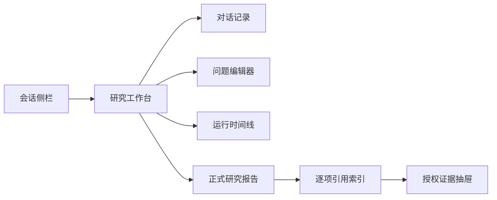
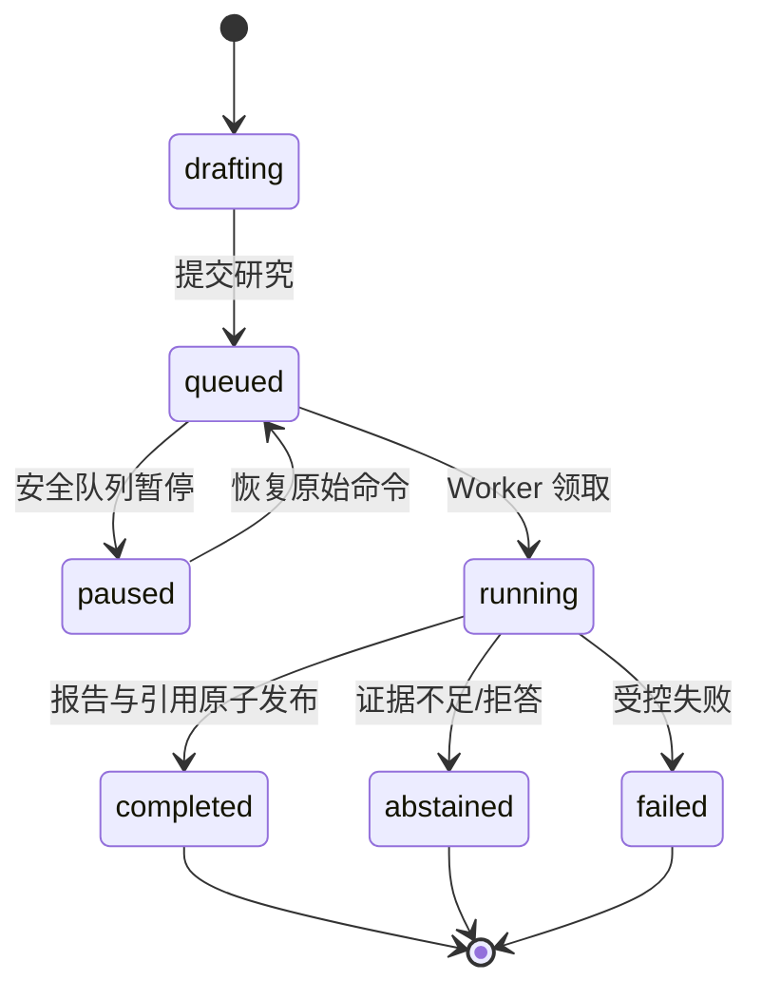

# 投研工作台产品交互规范

## 产品定位

工作台服务于内部美股研究人员。它的交互目标不是模仿开放式聊天，而是让研究人员能够在一个连续会话中提出问题、看见受控研究过程、审阅带定位的证据，并在任何网络或页面状态变化后恢复可审计的研究记录。

每个可验证结论都必须能回到授权证据；流式内容只是过程草稿，不能被误认为正式投资结论。产品始终显示“研究与教育用途”边界，不提供交易执行或个性化买卖建议。

## 信息架构

| 区域 | 用户目的 | 不可违反的产品规则 |
| --- | --- | --- |
| 会话侧栏 | 新建、选择、重命名、归档、恢复或删除会话 | 删除仅隐藏会话；不删除已发布报告、证据和审计记录 |
| 对话记录 | 回看问题和已发布回答 | 历史问题不可原地改写；编辑会生成新的研究 turn |
| 问题编辑器 | 编写、继续或重新发起研究 | 归档会话只能查看，恢复后才可提交；输入最多 1,600 字符 |
| 运行时间线 | 知道 Agent 正在做什么、是否失败、是否可恢复 | 仅显示经契约校验的持久化事件，不显示原始供应商错误 |
| 流式结论区 | 阅读尚在形成的研究内容 | 显式标记为“待引用审查”，不得显示为正式引用或报告 |
| 报告与证据 | 阅读最终结论并追溯来源 | 只有完成且通过服务端引用校验的报告才显示正式引用入口 |

## 核心用户旅程

### 1. 发起研究与流式查看

1. 研究员在新会话或活动会话中输入问题并提交。
2. 客户端创建不可变 `ResearchRun`，随后以 SSE 按 sequence 接收已持久化事件。
3. 页面依次展示意图、研究计划、任务开始/完成、证据就绪、待审查 Claim、Critic 结果和终态。
4. 连接断开时，客户端携带 `Last-Event-ID` 续传；重复 sequence 不重复渲染。
5. 完成后客户端读取版本化报告；若报告附件暂时不可读，显示可操作的刷新提示而不将其误报为研究失败。

**状态表达**：`研究正在运行`、`等待引用审查`、`已完成`、`部分回答/拒答`、`已失败` 必须区别显示。`claim_delta` 永远不等于已发布结论。

### 2. 暂停的双语义

产品将两个动作清楚分开，避免“停止生成”造成已调用工具被重复计费、丢失证据或产生不可回放状态。

| 动作 | 用户可见文案 | 实际行为 | 适用阶段 |
| --- | --- | --- | --- |
| 暂停展示 | `暂停展示` / `继续展示` | 浏览器暂停渲染并按事件序号缓冲；研究仍在既定预算内运行 | 任意流式运行 |
| 暂停后台任务 | `在队列中暂停` / `恢复研究` | 仅在 Worker 领取前使 `queued → paused`，记录审计事件；恢复时重投递同一不可变 command | 仅 queued |

对于已进入 `running` 的任务，产品不得承诺可强制停止。若未来增加真正的运行中暂停，必须先实现工具安全检查点、持久化恢复状态、已付费调用去重和 Worker 协调；在此之前只展示“暂停展示”。

浏览器在创建流式 turn 的响应头中取得服务端分配的 `x-research-run-id`。因此，在首个 SSE 事件到达之前也能向队列提交安全暂停请求；该 header 由 CORS 显式暴露，不能由客户端自造。暂停/恢复响应和后续 SSE 仍以服务端持久化状态为准。

### 3. 编辑、重新研究与会话管理

- 用户消息旁的“修改并重新研究”将原问题放回编辑器，并创建一个新的 turn；旧问题、运行、Claim 和引用仍保留。归档会话中的该动作和编辑器均为只读，必须先恢复会话。
- 会话标题可重命名，不改变任何运行的原始问题或审计快照。
- 归档使会话变为只读档案；恢复后才可继续研究。运行中的已启动任务允许安全地完成并写入其终态审计记录。
- 删除采用 tombstone：从用户列表隐藏，会话级证据仍遵循组织保留策略。二次确认必须解释这一点。
- 侧栏采用 active/archived 分组、快照一致的游标分页；滚动历史不会因新会话插入而跳页或漏页。
- 当研究创建请求尚未被服务端接受时，浏览器保留编辑器草稿并提示重试；一旦服务端已创建不可变 run，草稿才可清空，后续状态以该 run 的审计记录为准。

### 4. 引用与证据阅读

1. 正式报告中的 `[n]` 引用是受控按钮，而非直接拼接的任意链接。
2. 点击后打开证据抽屉，显示标题、来源类型、时间、原始定位、受许可的原文摘录和合法的 HTTP(S) 来源链接。
3. 证据 API 在读取时重新执行 tenant 与 entitlement 校验；不可见记录与不存在记录对客户端无差别。
4. 图谱线索和研究记忆可帮助检索，但不能作为引用或事实依据。
5. 重开历史会话时，工作台自动尝试打开最近一份已发布报告，并恢复其持久化的任务/工具/Critic 时间线；任意带 run ID 的助手消息也可单独打开对应正式报告。没有完成发布的拒答/失败 turn 保留原始说明，不展示伪造的引用入口。

## 状态与容错准则

- 异常、权限失败、供应商错误和网络错误使用稳定错误码与安全说明，详细诊断只进入受保护 trace/audit。
- 页面刷新或切换会话不应改变运行本身；运行事件和报告从服务端权威存储恢复。
- 归档/删除与运行终态并发时，以运行审计完整性优先：不再接受新输入，但已启动运行的受控终态可发布。
- 只有 `completed` 且报告已持久化时渲染正式报告；`abstained` 明确说明缺少有效证据而非编造结论。

## 可访问性与内容安全

- 所有图标型/状态型控件均有文字或 `aria-label`；键盘可完成会话选择、重命名、删除确认、问题编辑和引用打开。
- 流式区应使用非打断式状态更新，避免每条事件抢占读屏焦点；终态和错误使用可感知的状态提示。
- 报告仅解析受限 Markdown 子集，原始 HTML 作为文本转义；证据外链仅允许 HTTP(S)。
- 用户问题、工具输出、网页与文档中的指令均是不可信数据，不能改变系统提示、工具权限或用户授权。

## 本地验收场景

1. SSE 以任意分块、CRLF、多行 `data` 和心跳到达时，事件仍按顺序显示并可恢复。
2. 一个流式 Claim 在引用 gate 前没有正式编号；完成后每个 Claim 都可打开相应授权证据。
3. 在流式期间暂停展示，恢复后无重复、无乱序事件；后台运行预算不改变。
4. 队列中的运行暂停和恢复均产生可回放事件；运行中的暂停请求被明确拒绝，不伪造停止成功。
5. 编辑历史问题后旧 turn 不变，新 turn 具独立 run ID、工具审计和报告版本。
6. 归档会话拒绝新提交；恢复后重新可提交；删除后用户列表隐藏但审计资产仍可按授权保留。
7. 无权限、非 HTTP(S) 或失效引用不能被页面打开或渲染为可信来源。
